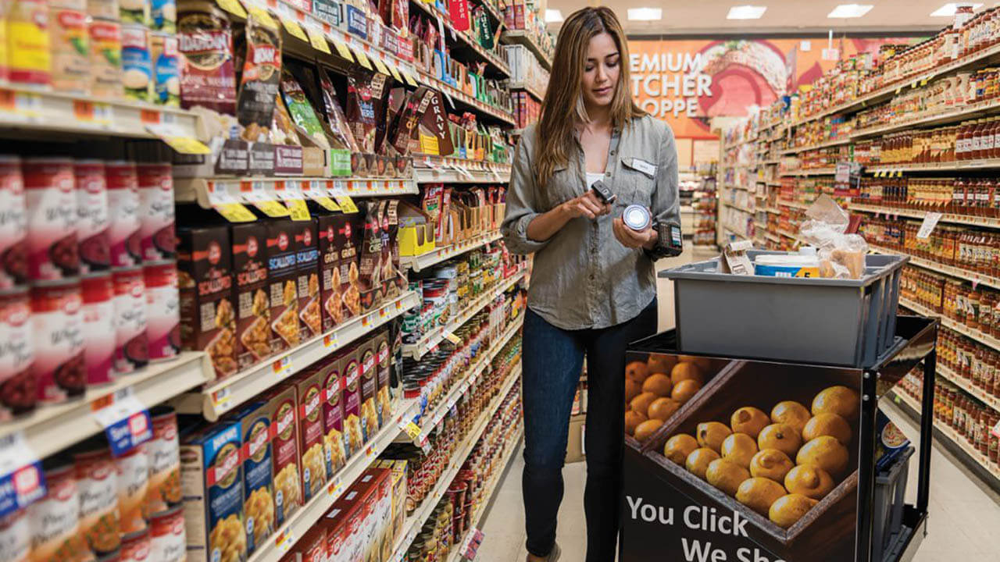
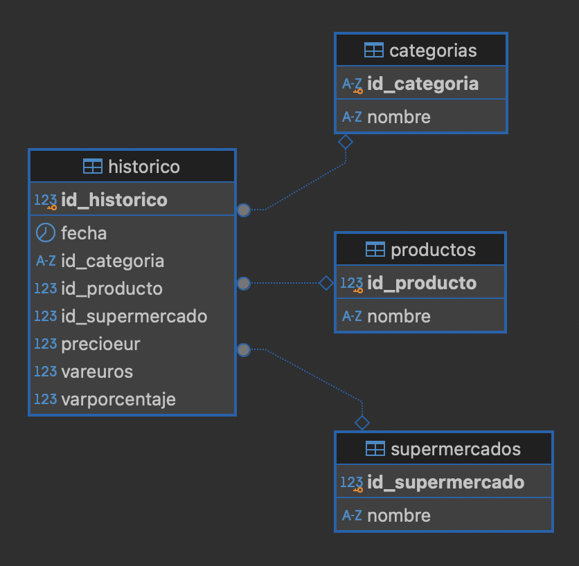

# Proyecto 4: Análisis Facua




## Planteamiento: **Analizando los precios de los supermercados**

- Este proyecto forma parte de un bootcamp de formación en Data Science e Inteligencia Artificial.

- El mismo hace uso de herramientas de scraping, procesamiento y análisis de datos para recolectar información sobre productos y precios de diferentes supermercados en España. La fuente principal de datos será la página web [FACUA: Precios Supermercados](https://super.facua.org/). A partir de los datos recolectados, se creará una base de datos en SQL, realizando un análisis exploratorio y generando visualizaciones que permitan extraer conclusiones sobre la variabilidad de precios entre supermercados y otras posibles tendencias.

- La página web de FACUA proporciona información actualizada sobre los precios de productos básicos en seis grandes supermercados de España: Alcampo, Carrefour, Dia, Eroski, Hipercor y Mercadona. Están agrupados en: aceite de girasol, aceite de oliva y leche. La plataforma revisa a diario la evolución de los precios, permitiendo a los consumidores estar informados sobre las fluctuaciones y posibles abusos en los precios.


## Objetivos del Proyecto

- **Scraping de datos**: Extraer información detallada de todos los productos disponibles en la web de FACUA para cada uno de los supermercados listados utilizando Selenium y Beautiful Soup.

- **Almacenamiento en base de datos**: Crear una base de datos en SQL que almacene la información recolectada de manera estructurada.

- **Análisis de Datos**: Realizar los siguientes análisis utilizando Python y Pandas:

   - **Comparación de Precios entre Supermercados**: Determinar qué supermercados ofrecen los precios más bajos y cuáles son más caros para cada producto.

   - **Análisis de la Evolución de Precios**: Estudiar cómo han cambiado los precios de los productos a lo largo del tiempo en distintos supermercados.

   - **Detección de Anomalías**: Identificar subidas o bajadas de precios inusuales que podrían señalar prácticas abusivas o promociones.

   - **Análisis de la Dispersión de Precios**: Evaluar la variabilidad de los precios de un mismo producto en diferentes supermercados.

   - **Comparación de Precios Promedio**: Calcular y comparar los precios promedio de cada producto en diferentes supermercados.

- **Visualización de datos**: Generar gráficos y visualizaciones que presenten de manera clara y comprensible los resultados del análisis.


## Estructura del repositorio

El proyecto está construido de la siguiente manera:

- **datos/**: Carpeta que contiene archivos `.csv`, `.json` o `.pkl` generados durante la captura y tratamiento de los datos.

- **images/**: Carpeta que contiene archivos de imagen generados durante la ejecución del código o de fuentes externas.

- **notebooks/**: Carpeta que contiene los archivos `.ipynb` utilizados en la captura y tratamiento de los datos. Están numerados para su ejecución secuencial.
  - `1_CapturaDatos`
  - `2_CreacionBaseDatos`
  - `3_QueriesVisualizaciónAnálisis`

- **src/**: Carpeta que contiene los archivos `.py`, con las funciones y variables utilizadas en los distintos notebooks.
  - `soporte_funciones.py`
  - `soporte_variables.py`


- `.gitignore`: Archivo que contiene los archivos y extensiones que no se subirán a nuestro repositorio, como los archivos .env, que contienen contraseñas.


## Lenguaje, librerías y temporalidad
- El proyecto fué elaborado con Python 3.9 y múltiples librerías de soporte:

    - *Librerías para el tratamiento de datos*
    - [Pandas](https://pandas.pydata.org/docs/)
    - [Numpy](https://numpy.org/doc/)

    - *Librerías para captura de datos*
    - [Selenium](https://selenium-python.readthedocs.io)
    - [Beautiful Soup](https://www.crummy.com/software/BeautifulSoup/bs4/doc/)
    - [Requests](https://pypi.org/project/requests/)

    - *Librerías para gestión de tiempos*
    - [Time](https://docs.python.org/3/library/time.html)
    - [tqdm](https://numpy.org/doc/)

    - *Librerías para graficar*
    - [Plotly](https://plotly.com/python/)
    - [Seaborn](https://seaborn.pydata.org)
    - [Matplotlib](https://matplotlib.org/stable/index.html)

    - *Librería para gestionar tokens y contraseñas*
    - [DotEnv](https://pypi.org/project/python-dotenv/)

    - *Librería para controlar parámetros del sistema*
    - [Sys](https://docs.python.org/3/library/sys.html)

    - *Librería para conexión a bases de datos SQL*
    - [psycopg2](https://www.psycopg.org/docs/)

    - *Librería para la gestión de avisos*
    - [warnings](https://docs.python.org/3/library/warnings.html)


- Este proyecto es funcional a fecha 28 de octubre de 2024, sin embargo, dependendiendo de terceros para la captura de datos (scraping de sitios web), los mismos podrían no estar disponibles o requerir de modificaciones para su tratamiento y captura en el futuro.


## Instalación

1. Descarga DBeaver y crea una base de datos llamada "Facua". Puedes consultar la documentación de DBeaver [aquí](https://dbeaver.com/docs/dbeaver/).

2. Clona el repositorio
   ```sh
   git clone https://github.com/davfranco1/Proyecto4-AnalisisFacua.git
   ```
3. Instala las librerías que aparecen en el apartado anterior. Utiliza en tu notebook de Jupyter:
   ```sh
   %pip install nombre_librería
   ```
4. Genera un archivo para almacenar tus tokens y contraseñas, en este caso para la base de datos de DBeaver:
   Entra en la carpeta `src` y crea `.env`, que contenga el siguiente script, sin olvidar las comillas:
   ```js
   dbeaver_pw = 'contraseña_de_tu_base_de_datos'
   ```

5. Cambia la URL del repositorio remoto para evitar cambios al original.
   ```sh
   git remote set-url origin usuario_github/nombre_repositorio
   git remote -v # Confirma los cambios
   ```

6. Ejecuta el código en los notebooks.


## Estructura de la base de datos



- Este gráfico muestra el diseño de una base de datos relacional con cuatro tablas: "histórico", "categorias", "productos" y "supermercados". 

- La tabla "histórico" está relacionada con las otras tres a través de las columnas id_categoria, id_producto, y id_supermercado, que actúan como claves foráneas (FK).

- Las tablas "categorias", "productos" y "supermercados" contienen, como sus nombres indican, los nombres de las categorías, los productos y los supermercados.

- El diseño destaca por varias razones:

1. **Normalización:** Las tablas están normalizadas, lo que reduce la redundancia y mejora la integridad de los datos. Cada tabla tiene una clave primaria única (PK) (id_historico, id_categoria, id_producto, id_supermercado) que identifica de manera única cada registro. Cuando se tienen "formas normales", los datos se dividen en tablas relacionadas que garantizan que cada dato se almacene solo una vez.

2. **Relaciones claras:** Las relaciones entre las tablas están claramente definidas mediante claves foráneas, o foreign keys (FK). Esto facilita la consulta y el mantenimiento de la base de datos. Por ejemplo, la tabla "histórico" puede referenciar las categorías, productos y supermercados, sin duplicar información.

3. **Escalabilidad:** Este diseño permite agregar nuevas categorías, productos y supermercados sin necesidad de modificar la estructura de la tabla "histórico". Solo se necesita insertar nuevos registros en las tablas correspondientes.

4. **Consultas eficientes:** La estructura facilita la realización de consultas complejas. Por ejemplo, se puede obtener información histórica de precios y variaciones de productos específicos en supermercados específicos, utilizando las relaciones definidas.

- Un diseño es eficiente y bien estructurado cuando es escalable y facilita la gestión y consulta de los datos almacenados.


## Conclusiones y Próximos Pasos

- Te invitamos a descargar el [PDF Resultados](Resumen.pdf), que resume de manera gráfica el EDA que hemos preparado.

- Además, el notebook [3_QueriesVisualizaciónAnálisis](https://github.com/davfranco1/Proyecto4-AnalisisFacua/blob/main/notebooks/3_QueriesVisualizaciónAnálisis.ipynb), contiene explicaciones de los datos y las visualizaciones generadas durante el proyecto.


## Autor

David Franco - [LinkedIn](https://linkedin.com/in/franco-david)

Enlace del proyecto: [https://github.com/davfranco1/Proyecto4-AnalisisFacua](https://github.com/davfranco1/Proyecto4-AnalisisFacua)
